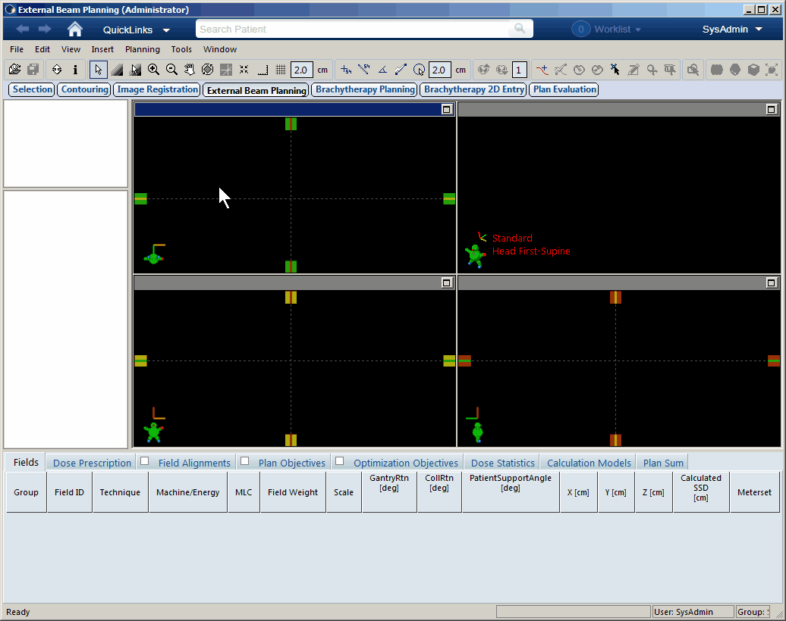

# EQD2Calc

Eclipse (Varian Medical Systems) で利用できるEQD2計算用のスクリプトです。

## 使い方

このリポジトリを画面右上の`Clone or download`からダウンロードし、`EQD2Calc.cs`を取り出します。

EclipseのExternal Beam Planningにて、`Tools -> Scripts`から`EQD2Calc.cs`を指定すれば実行されます。

### Total Doseが決まっていて、EQD2を求めたい場合

Calculation Modeにて「EQD2を計算」を指定して、&alpha;/&beta;、総線量、分割回数を入力してください。

### EQD2が決まっていて、Total Doseを求めたい場合

Calculation Modeにて「TotalDoseを計算」を指定して、&alpha;/&beta;、EQD2、分割回数を入力してください。
